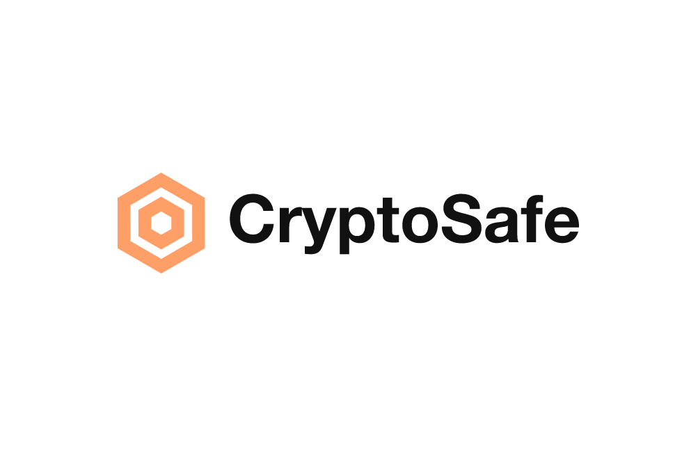

 

    

 

## CryptoSafe : Store your cryptos on a recoverable safe

CryptoSafe is a recoverable safe that stores your crypto assets on recoverable smart contract so that you don't have the fear of loosing them. You can also recover your safe if you lost the access to the safe by setting up backup address.

Built as a prototype for the Scaling Ethereum 2023 hackathon.

Live :

Video :

### Motivation

There are a lot of incidents happening where people are loosing there crypto assets just because they lost there access to the wallet or private keys.

This brought the need for contract based accounts and remove the need for EOA's, so storing cryptos on a recoverable safe contract brings out a good use case where the user can create a safe and store there crypto assets on a contract just like in the traditional world banks store your money.
Users can recover there safe if at any case they lost the access to the safe by setting up a backup address which will help them regain ownership to there safe.
Users can also withdraw there stored assets from the safe anytime.
Users can pay fees with any of the asset present in there wallet to create a safe like USDC,DAI,ETH etc.

## Technologies used

CryptoSafe is currently available on Layer-2 Polygon zkEVM & zkSync Era Testnet.

- Polygon zkEVM:
  Polygon zkEVM Beta harnesses the power of ZK proofs to reduce transaction cost and massively increase throughput, all while inheriting the security of Ethereum L1.

- zkSync Era:
  zkSync Era is a Layer-2 protocol that scales Ethereum with cutting-edge ZK tech. Our mission is not only to merely increase Ethereum's throughput, but to fully preserve its foundational values – freedom, self-sovereignty, decentralization – at scale.

- React:
  React is a free and open-source front-end JavaScript library for building user interfaces based on components. It is maintained by Meta and a community of individual developers and companies.

### How to run

1.

<pre>
    
</pre>

2. ``

### Example CryptoSafe (try these out!)

Connect to the appropriate network via metamask and visit the following links.

CryptoSafe Contract(Polygon zkEVM): https://explorer.public.zkevm-test.net/address/0x99E0dB72A90c00EfdD834C8cb93409bc0eBE1817

CryptoSafe Contract(zkSync Era): https://zksync2-testnet.zkscan.io/address/0x845835274d85d210e3377f41A4305945aD8de61F/transactions

Safe created using (zkSync Era): https://zksync2-testnet.zkscan.io/address/0x5c72600538bcC5CC4099EA07F0346A2014359135/transactions

### Screenshots

#### Home

#### Creating a new safe contract

#### Connecting wallet / switching L2 networks

#### Deposit cryptos in a safe

#### Pay Fees with any token

#### Withdraw funds from safe

####

## Potential future work

1. Integration with more blockchain networks: Currently, CryptoSafe is designed to work on some the popular Layer 2 network zkSync Era, but there are many other blockchain networks out there that could benefit from a similar platform. Future work could involve adapting the platform to work with other popular blockchain networks such as Bitcoin, Binance Smart Chain, or Polkadot.

2. Adding new features: As the platform evolves, there will be opportunities to add new features that enhance the user experience and make the platform more useful. For example, one possible feature could be the ability to intergrate the functionality with DEXes so that people can earn some interest from the money which is sitting idle on the safe.

3. Load testing: As the user base grows, the platform will need to be able to handle an increasing volume of traffic and data. Future work could involve improving the platform's scalability and performance to ensure that it can handle a large number of users and transactions without slowing down or becoming unreliable.

4. Add mainnet network selection and (potentially separate) deployments for each.

#### Revenue opportunities

- DEXes integration can help users earn interest on there assets in the safe where the Cryptosafe platform can work like the traditional banks where they give loans to the other users and then earn interest and is shared between the banks and the users.
- Premium features or functionalities for a monthly or annual subscription fee. For giving users an annual customized report about there safe.
